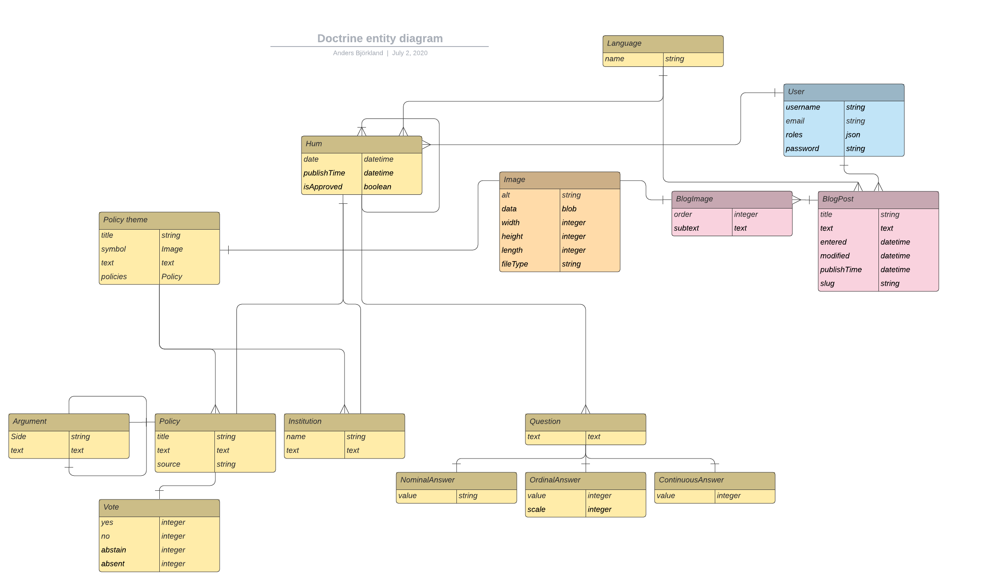

# Hum - Policies made easy
Fair, friendly and accessible. This is a webproject to promote awareness about Swedish politics.
We aim to provide a user friendly experience on everyday policies where our visitors get to reflect on their place in 
the political landscape.

The project is made up of two parts: Frontend and Backend. This is the repository for the Backend.

## Technologies
The backend is build upon PHP, so the technologies used reflects this:
* PHP 7.4 as main language.
* Symfony 5.1 is the core framework.
* MariaDB version 10.3.23

### Complimentary technologies
* Api Platform. 
* Doctrine, ORM

## Entities
The backend is built on a relational database. In the following 
diagram the entities that make up the backend are related with each other. 
I have excluded mapping out such things as primary key and foreign key, I 
let the entity lines do the explaining. 

Some entities can have a child or children of their own. Hum, BlogPost and Argument are
examples of this. In the case for Hum and BlogPost, the idea is that the english version 
is the parent, and then other languages can be children of it. In the case of 
Argument, it can only have one child Argument each. This builds a linear style for presenting argumentations 
on policy.

